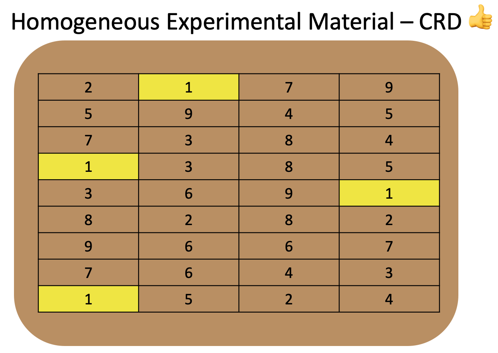
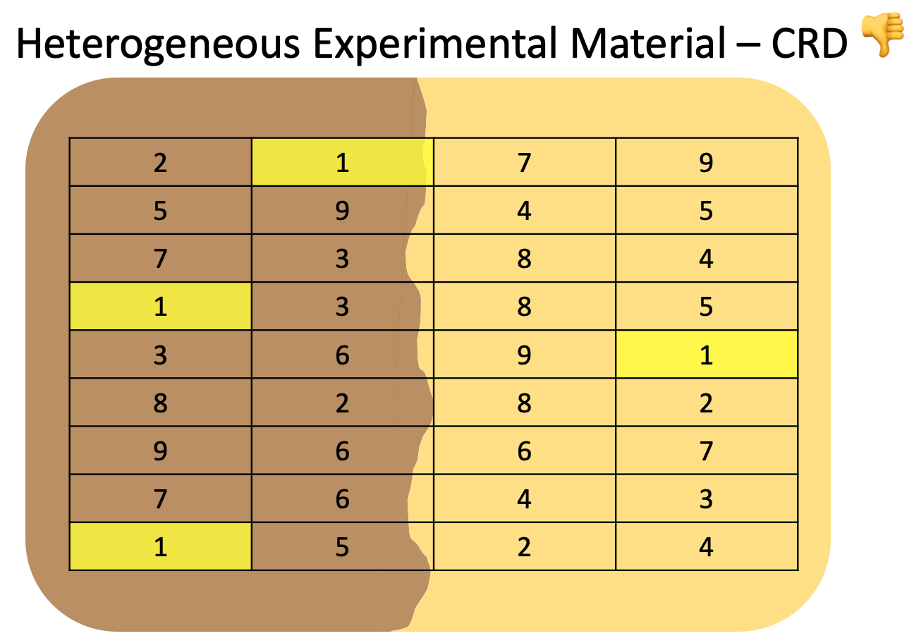
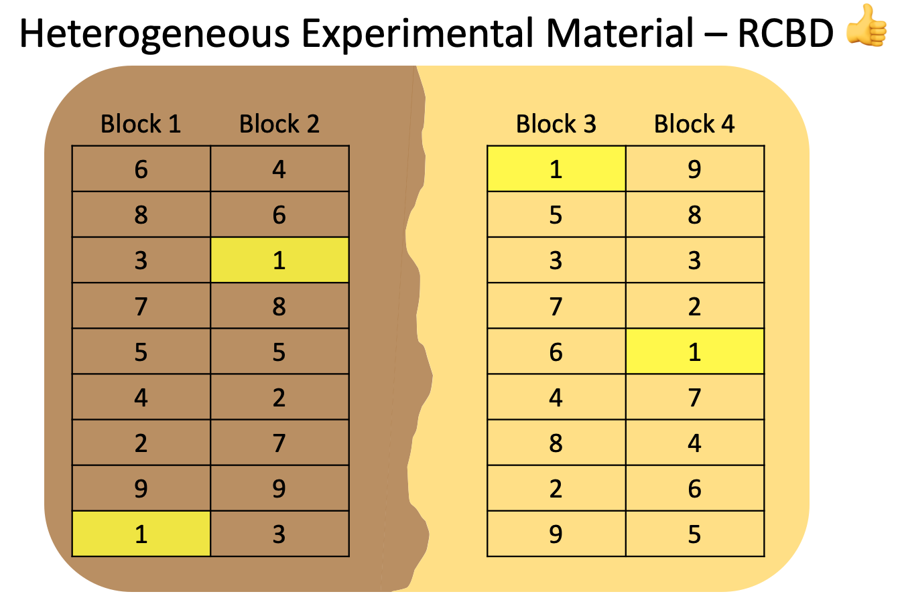
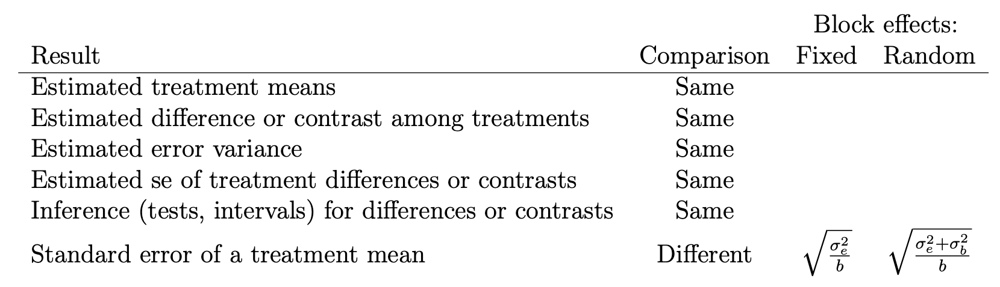

# 1) Housekeeping  
  - 4 hours split into 2 days.
  - Day 1: ANOVA and Experimental Design.  
  - Day 2: ANOVA vs. Regression.
  - Questions: post on the chat, moderator will read.  
  - Technical issues.  
  - If possible, use 2 screens (one for zoom, one for RStudio).  
  - Pre-requisites to follow along:
  - RStudio
  - RStudio projects
  - Rmarkdown
  - Data wrangling and pipe operator  
  - Plotting with ggplot  
  - STAT 705  
  - agRonomy blog: https://agronomy.netlify.app


# 2) Introduction  
This script was written for teaching during the KSU Agronomy R Workshop Day 1 - ANOVA and Experimental Design section.  

During this first day, we are going to explore the following topics:  
- Two datasets containing corn grain yield response to seeding rate, one coming from a *well-conducted completely randomized design*, and another coming from a *well-conducted randomized complete-block design*.  

- Complete analysis (data import, exploratory data analysis, formal statistical analysis, ANOVA table, treatment mean extraction, letter separation, publication-quality plot) for the well-conducted CRD dataset.  

- Complete analysis for a poorly-conducted CRD dataset.  

- Complete analysis for a well-conducted RCBD dataset.  

- Comparison between a fixed-effect and random-effect block models. Should you be treating your blocks as random or fixed? Does it matter?


# 3) Setup  
Here is where we load the packages we will use.  
```{r setup}
# Loading packages
library(tidyverse) # for data wrangling and plotting
library(broom.mixed) # for residual diagnostics
library(car) # for Anova function
library(lmerTest) # for mixed-effect modeling
library(emmeans) # for model mean extraction
library(multcomp) # for pairwise comparison letter display
library(knitr) # for figure displaying
```

# 4) Experimental Design  
**Experimental design** is the part of the study design related to how your treatments are assigned to the experimental units.

The decision of which experimental design to use should be guided by two factors:  

1. Homogeneity of experimental material  
2. Limitations such as funds, space in an incubator, size of the benches, size of a field.  

Two of the most common experimental designs in agriculture are  

- Completely randomized design (CRD)  
- Randomized complete-block design (RCBD)  

Question before setting up the study:  

> "Do I have enough homogeneous experimental material to accommodate all experimental units?".

# 5) Homogeneous Experimental Material -  
# Correct CRD  
If **Yes**, then you can use **CRD** as the experimental design, and treatments will be randomized to the **entire area** (no restrictions in randomization).

```{r CRD figure, echo=F}

```
Because the experimental material is homogeneous (same soil texture class), this should not be an issue when estimating treatment means and performing comparisons.  

## Hands-on  
## a) Data import
```{r crd data import}
crd_df 

crd_df
```
## b) Data summary and wrangling  
```{r crd summary}

```


```{r crd glimpse}

```

```{r crd wrangling}
crd_dfw 

summary(crd_dfw)
```
## c) Exploratory Data Analysis  
```{r crd exp boxplot}

```

## d) Statistical model  
```{r crd model}
# Changing to sum-to-zero contrast
options(contrasts = c("contr.sum", "contr.poly"))

# Model fitting
crd_mod 

# Summary
```

```{r crd residual check}

```

## e) ANOVA table  
```{r crd ANOVA}

```

## f) Means and PWC  
```{r crd means}
crd_means 

crd_means
```

```{r crd PWC}
crd_cld

crd_cld
```

## g) Final plot  
```{r crd final plot}

```


# 6) Heterogeneous Experimental Material -  
# Wrong CRD  
If the answer is **No**, then you should consider what types of limitation you have and which experimental design can be used.

Let's say we answered **No** in our example.  
We know that the area has **heterogeneity in soil texture**, a feature that likely impacts corn yield.  

If we were to **continue using a CRD**, here's what it would look like:
```{r CRD figure bad, echo=F}

```

Note that following the same unrestricted randomization process, now treatment 1 appears 3 times under a darker soil texture, and only 1 time under a light soil texture. This happens for many treatments.  

Suppose that **dark soil texture** has a **positive effect on corn yield**, and light soil texture has a negative effect.   
In this case, using a CRD as in the example above, treatment 1 would likely have an **average yield that is overestimated** due to the unbalanced number of reps in each soil texture class.  

This has a **negative effect** on both **treatment means (biased)** and on the analysis **standard error (inflated)**, which makes treatment comparisons unfair and inaccurate (more difficult to detect real differences).  

## Hands-on
## a) Data import
```{r crdbad data import}
rcbd_df 

rcbd_df
```
## b) Data summary and wrangling  
```{r crdbad summary}
summary(rcbd_df)
```


```{r crdbad glimpse}
glimpse(rcbd_df)
```

```{r crdbad wrangling}
crdbad_dfw 

summary(crdbad_dfw)
```
## c) Exploratory Data Analysis  
```{r crdbad exp boxplot}
ggplot(crdbad_dfw, aes(x=fSR_ksha, y=Yield_Mgha))+
  geom_boxplot()
```

## d) Statistical model  
```{r crdbad model}
# Changing to sum-to-zero contrast
options(contrasts = c("contr.sum", "contr.poly"))

# Model fitting
crdbad_mod 

# Summary
summary(crdbad_mod)
```

```{r crdbad residual check}

```

## e) ANOVA table  
```{r crdbad ANOVA}

```

## f) Means and PWC  
```{r crdbad means}
crdbad_means

crdbad_means
```

```{r crdbad PWC}
crdbad_cld 

crdbad_cld
```

## g) Final plot  
```{r crdbad final plot}

```

So what should we do?  

# 7) Heterogeneous Experimental Material -  
# Correct RCBD, blocks fixed  

```{r RCBD figure, echo=F}

```
Note how each treatment appears once and only once in every block. Now, the **increased variability** in corn yield caused by **soil texture (experimental material heterogeneity)** will be **confined to the block effect**, and thus can be properly dissected and not affect our inference on the treatment design variables.  
## Hands-on  
## a) Data import
```{r rcbd data import}
# Same as in #6
rcbd_df
```

## b) Data summary and wrangling  
```{r rcbd wrangling}
# Just giving it a different name, but same as in #6
rcbd_dfw <- rcbd_df %>%
  mutate(Rep=factor(Rep),
         fSR_ksha=factor(SR_ksha))

summary(rcbd_dfw)
```
## c) Exploratory Data Analysis  
```{r rcbd exp boxplot}
# Same plot as in #6
ggplot(rcbd_dfw, aes(x=fSR_ksha, y=Yield_Mgha))+
  geom_boxplot()
```

## d) Statistical model  
```{r rcbd model}
# Changing to sum-to-zero contrast
options(contrasts = c("contr.sum", "contr.poly"))

# Model fitting
rcbd_mod

# Summary
```

```{r rcbd residual check}

```

## e) ANOVA table  
```{r rcbd ANOVA}

```

## f) Means and PWC  
```{r rcbd means}
rcbd_means

rcbd_means
```

```{r rcbd PWC}
rcbd_cld

rcbd_cld
```

## g) Final plot  
```{r rcbd final plot}

```

# 8) Heterogeneous Experimental Material -  
# Correct RCBD, blocks random  
Should we treat block as fixed or random?  
  
Some general guidelines to consider random:  
  - Does it represent a sample of a larger well-defined population (of blocks)?  
  - How many levels? (>10 better)  
  
Let's try it out and compare.  

## Hands-on  
## a) Data import
```{r rcbdrand data import}
# Same as in #7
rcbd_df
```

## b) Data summary and wrangling  
```{r rcbdrand wrangling}
# Same as in #7
summary(rcbd_dfw)
```

## c) Exploratory Data Analysis  
```{r rcbdrand exp boxplot}
# Same plot as in ex above
ggplot(rcbd_dfw, aes(x=fSR_ksha, y=Yield_Mgha))+
  geom_boxplot()
```

## d) Statistical model  
```{r rcbdrand model}
# Changing to sum-to-zero contrast
options(contrasts = c("contr.sum", "contr.poly"))

# Model fitting
rcbdrand_mod 

# Summary
```

Let's compare this with summary on in #7 (rcbd block fixed).

What do you see different?


```{r rcbdrand residual check}

```

## e) ANOVA table  
```{r rcbdrand ANOVA}

```

## f) Means and PWC  
```{r rcbdrand means}
rcbdrand_means <- emmeans(rcbdrand_mod, ~fSR_ksha)

rcbdrand_means
```

```{r rcbdrand PWC}
rcbdrand_cld 

rcbdrand_cld
```

Let's compare this with cld on in #7 (rcbd block fixed).

What do you see different?

## g) Final plot  
```{r rcbdrand final plot}

```

Let's compare this with plot in #7 (rcbd block fixed).

What do you see different?


## Final considerations on block  
Here's a summary of differences between treating block as fixed OR random effect in balanced RCBDs like the one above (extracted from `2016 Dixon - Should blocks be fixed or random?`):  
```{r fixed vs random summary}

```


Dixon's plus my own recommendation for selecting block as fixed or random:  

1) IF have a regular RCBD where all treatments appear in all blocks (balanced blocks, no missing data), AND number of blocks < 12 (MOST OF THE CASES IN AG!), AND is not using model for prediction, THEN treat as fixed.  

This will facilitate treatment mean+error display, and it won't affect anything else compared to treating block as random.  

2) IF have inter-block information due to unbalanced blocks (missing data, incomplete blocks), AND number of blocks > 12, THEN may treat as random.  

Using random blocks here help in incorporating both inter- and intra-block information in treatment means and sd.  

3) IF everything said in 1) BUT model will be used for prediction, THEN treat as random.  

This will help to use the model object to predict new data (more on this tomorrow).  

# 9) Publication-ready final plot  
```{r pub-ready plot}

```


