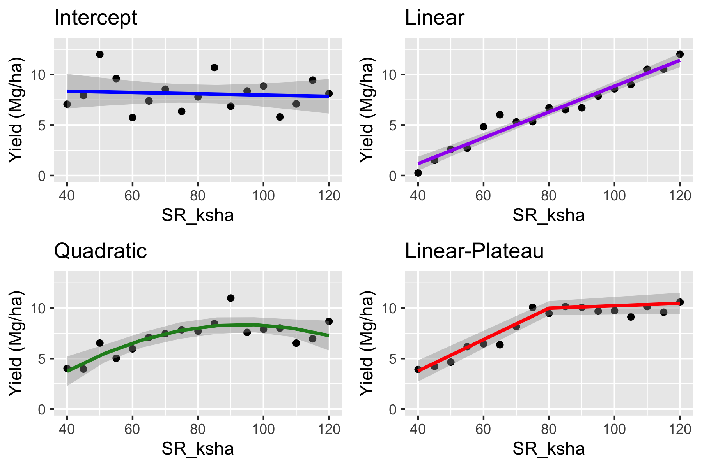

# 1) Housekeeping  
  - Day 2: ANOVA vs. Regression.
  - Questions: post on the chat, moderator will read.  
  - Technical issues.  
  - agRonomy blog: https://agronomy.netlify.app


# 2) Introduction  
This script was written for teaching during the KSU Agronomy R Workshop Day 2 - ANOVA vs. Linear Regression.  

During this second day, we are going to explore the following topics:  
- One dataset containing corn grain yield response to seeding rate coming from a *well-conducted randomized complete-block design*.

- Complete linear regression analysis (data import, exploratory data analysis, formal statistical analysis, ANOVA table, treatment mean extraction, letter separation, publication-quality plot) on the data above.  

- Discuss about ANOVA (yesterday) and regression differences, and when we use each case.  

- Complete quadratic linear regression on data.

- Complete linear-plateau regression on data.

- Compare linear-plateau vs. quadratic regressions. Which one fits the data best? Choose one to proceed and use in the next steps.  

- Use regression for optimum-finding.  

- Use regression for prediction.  


# 3) Setup  
Here is where we load the packages we will use.  
```{r setup}
# Loading packages
library(tidyverse) # for data wrangling and plotting
library(broom.mixed) # for residual diagnostics
library(car) # for Anova function
library(lmerTest) # for mixed-effect modeling
library(emmeans) # for model mean extraction
library(multcomp) # for pairwise comparison letter display
library(knitr) # for figure displaying
library(nlme) # for non-linear modeling
library(Metrics) # for RMSE

```

# 4) Linear regression  
## a) Data import
```{r reg data import}
reg_df 

reg_df
```
## b) Data summary and wrangling  
```{r reg summary}
summary(reg_df)
```

```{r reg glimpse}
glimpse(reg_df)
```

```{r reg wrangling}
reg_dfw <- reg_df %>%
  mutate(Rep=factor(Rep))

summary(reg_dfw)
```


## c) Exploratory Data Analysis  
```{r reg exp boxplot}
ggplot(reg_dfw, aes(x=SR_ksha, y=Yield_Mgha))

```
What is going on on this boxplot?


```{r reg plot point + smooth}
ggplot(reg_dfw, aes(x=SR_ksha, y=Yield_Mgha))

```

## d) Statistical model  
```{r reg model}
# Changing to sum-to-zero contrast
options(contrasts = c("contr.sum", "contr.poly"))

# Model fitting
reg_mod <- lmer(Yield_Mgha ~ (1|Rep) + SR_ksha, data=reg_dfw)

# Summary
summary(reg_mod)
```
## e) Model Assumptions  
```{r reg residual plot}
plot(reg_mod)
```


We can use the function augment to extract model residuals and have more control over the plot.   

```{r reg augmenting}
# Augmenting and adding perason standardized residuals
reg_aug <- augment(reg_mod) %>%
  mutate(.stdresid=)
  
  
reg_aug
```

### Within-group errors are iid ~ N(0, var2)  
```{r reg Standardized Residuals vs. Fitted}
ggplot(reg_aug, aes(x=.fitted, y=.stdresid))+
  geom_hline(yintercept = 0, color="red")+
  geom_point()

```

Residuals looking bad! Clear pattern!
We will need to address this problem later!  

For now, let's keep going.

```{r reg Quantile-Quantile}
ggplot(reg_aug, aes(sample=.stdresid))+
  stat_qq()
```

### Random effects are iid ~ N(0,var1)  
On this plot, looking for normality.  
```{r QQ plot for Location:fRep random effects}
randeff_Rep<- ranef(reg_mod)[[1]] 

ggplot(randeff_Rep, aes(sample=`(Intercept)`))+
  stat_qq()+
  stat_qq_line()

```

## e) ANOVA table  
```{r reg ANOVA}
Anova(reg_mod, type=3)

```
Slope for SR_ksha is highly significant!  

This is similar information from summary() (which is not the case for when we run ANOVA models with SR as categorical).

## f) Regression Means?  
```{r reg means}
reg_means

reg_means
```

What's the meaning of these "means"?  
```{r reg means plot}
ggplot(reg_dfw, aes(x=SR_ksha, y=Yield_Mgha))+
  geom_point()+
  geom_smooth(method="lm", color="red")

```


## g) Final plot  
```{r reg final plot}
ggplot(reg_aug, aes(x=SR_ksha, y=Yield_Mgha))+
  geom_point()
  
  
```

No means+sd or letter separation.
Only regression equation!

# Linear thoughts:
Just because p-value is significant, it DOES NOT mean the model is good. Always check residuals!!

# 4) Quadratic regression  
## a) Data import
```{r regquad data import}
# Same data as on #3
reg_df
```
## b) Data summary and wrangling  
```{r regquad summary}
# Same as on #3
summary(reg_df)
```

```{r regquad glimpse}
# Same as on #3
glimpse(reg_df)
```

```{r regquad wrangling}
# Same as on #3
reg_dfw <- reg_df %>%
  mutate(Rep=factor(Rep))

summary(reg_dfw)
```

## c) Exploratory Data Analysis  
```{r regquad plot point + smooth}
ggplot(reg_dfw, aes(x=SR_ksha, y=Yield_Mgha))+
  geom_point()

```

## d) Statistical model  
```{r regquad model}
# Changing to sum-to-zero contrast
options(contrasts = c("contr.sum", "contr.poly"))

# Model fitting
regquad_mod <- lmer(Yield_Mgha ~ , data=reg_dfw)

# Summary
summary(regquad_mod)
```
## e) Model Assumptions  
```{r regquad residual plot}
plot(regquad_mod)
```

```{r regquad augmenting}
# Augmenting and adding pearson standardized residuals
regquad_aug <- augment(regquad_mod) %>%
  mutate(.stdresid=resid(regquad_mod, 
                         type="pearson", 
                         scaled=T))
  
  
regquad_aug
```

### Within-group errors are iid ~ N(0, var2)  
```{r regquad Standardized Residuals vs. Fitted}
ggplot(regquad_aug, aes(x=.fitted, y=.stdresid))+
  geom_hline(yintercept = 0, color="red")+
  geom_point()+
  geom_smooth(method="lm", formula=y~x+I(x^2))
```


```{r regquad Quantile-Quantile}
ggplot(regquad_aug, aes(sample=.stdresid))+
  stat_qq()+
  stat_qq_line()
```

### Random effects are iid ~ N(0,var1)  
On this plot, looking for normality.  
```{r regquad QQ plot for Rep random effect}
randquadeff_Rep<- ranef(regquad_mod)[[1]] 

ggplot(randquadeff_Rep, aes(sample=`(Intercept)`))+
  stat_qq()+
  stat_qq_line()

```

## e) ANOVA table  
```{r regquad ANOVA}
Anova(regquad_mod, type=3)

```
Slope and curvature for SR_ksha is highly significant!  

This is similar information from summary() (which is not the case for when we run ANOVA models with SR as categorical).


## g) Final plot  
```{r regquad final plot}
ggplot(regquad_aug, aes(x=SR_ksha, y=Yield_Mgha))+
  geom_point()+
  geom_line(aes(y=.fixed), color="forestgreen")

```

```{r regquad better final plot}
# Creating predictions
nd 

nd <- nd %>%
  mutate(Yieldpred_Mgha=predict(regquad_mod, nd, re.form=NA))

#Bootstrapping for confidence interval
predict.fun <- function(mod) {
  predict(mod, newdata = nd, re.form = NA)
}

regquad_boots <- bootMer(regquad_mod, 
                         predict.fun, nsim = 200) 
  

nd <- nd %>%
  bind_cols(regquad_boots)

nd

ggplot(reg_dfw, aes(x=SR_ksha, y=Yield_Mgha))+
  geom_point()+
  geom_line(data=nd, aes(y=Yieldpred_Mgha), color="forestgreen")


```

Now, which one fits the data best?  
Which one should we chose for predicting new data, or finding the optimum?  

# 5) Regression use - Finding optimum input level  
One of the main goals of applying different levels of an input (e.g., seeding rate) and measuring its effect on an output (e.g., yield) is to estimate the optimum input level that maximizes the output.  

Here, our input is seeding rate, but it could be a range of other types of inputs:  
  - Fertilizer  
  - Pesticide  
  - Irrigation volume  
  - Temperature and air relative humidity (controlled environments)
  - Planting date  
  - Others?
  
## Different input x output responses  
Anytime we have this input x output relationship, a few different patterns can emerge.

```{r input output relationships figure, echo=F}

```
Talk about each of these patterns.

In our dataset, 
  - We know there is a yield response to SR (so intercept-only model is not a good candidate),  
  - We know we have achieved a maximum point (so linear is not a good candidate)  
  - We have already fit the quadratic model.  
  - We can fit the linear-plateau model.
  
So, let's fit a LP model and then compare it to the quadratic.  
After that, we can choose the model that best fit our data use it to extract the optimum seeding rate.


# 6) Linear-plateau regression  
```{r Creating the non-linear function}
f.lrp <- function(x, a, b, t.x) {
    ifelse(x > t.x, a + b * t.x, a + b * x)}
```

## a) Initial parameters  
```{r using quadratic fit coefficients}
coef(regquad_mod)
```

```{r eyballing breakpoint}
ggplot(reg_dfw, aes(x=SR_ksha , y=Yield_Mgha))+
  geom_point()+
  scale_y_continuous(limits=c(0,16))
```

## b) Statistical model  
```{r LP model}
linp_mod <- nlme(Yield_Mgha ~ f.lrp(SR_ksha, a, b, t.x), 
                     data = reg_dfw, 
                     start = c(a =0 , b = 0.3, t.x =100),
                     
                     fixed = list(a ~ 1,
                                  b ~ 1,
                                  t.x ~ 1),
                 
                     random = list(Rep = pdDiag(a + b + t.x ~ 1)))

# Checking the model output
linp_mod
```


```{r linpd summary}
summary(linp_mod)
```

## c) Model Assumptions  
```{r linp residual plot}
plot(linp_mod)
```

```{r linp augmenting}
# Augmenting and adding perason standardized residuals
linp_aug <- augment(linp_mod, data=reg_dfw) %>%
  mutate(.stdresid=resid(linp_mod, type="pearson", scaled=T))
  
  
linp_aug
```

### Within-group errors are iid ~ N(0, var2)  
```{r linp Standardized Residuals vs. Fitted}
ggplot(linp_aug, aes(x=.fitted, y=.stdresid))+
  geom_hline(yintercept = 0, color="red")+
  geom_point()+
  geom_smooth(method="lm", formula=y~x+I(x^2))
```


```{r linp Quantile-Quantile}
ggplot(linp_aug, aes(sample=.stdresid))+
  stat_qq()+
  stat_qq_line()
```

### Random effects are iid ~ N(0,var1)  
On this plot, looking for normality.  
```{r linp QQ plot for Rep random effect}
linpeff_Rep<- ranef(linp_mod) 

ggplot(linpeff_Rep, aes(sample=Value))+
  stat_qq()+
  stat_qq_line()+
  facet_wrap(.~Variable, scales="free")

```

## d) Final plot  
```{r linp final plot}
ggplot(linp_aug, aes(x=SR_ksha, y=Yield_Mgha))+
  geom_point()+
  #geom_point(aes(y=.fixed), color="purple")+
  geom_line(aes(y=.fixed), color="purple")
```

```{r linp better final plot}
# Creating predictions
nd <- nd %>%
  mutate(YieldLP_Mgha=predict(linp_mod, nd, level=0))


ggplot(reg_dfw, aes(x=SR_ksha, y=Yield_Mgha))+
  geom_point()+
  geom_line(data=nd, aes(y=YieldLP_Mgha), color="red")


```

# 7) Selecting best model  
Now that we have our two model candidates for best fitting our data, let's compare them.  

## a) Visual comparison  
```{r comparison plot}
ggplot(reg_dfw, aes(x=SR_ksha, y=Yield_Mgha))+
  geom_point()


```

## b) Table comparison
```{r comparison table}
reg_dfw <- reg_dfw %>%
  # Predicting Quadratic
  mutate(Yieldpred_Mgha) %>%
  # Predicting LP
  mutate(YieldLP_Mgha)


# Extracting model RMSE and AIC 
reg_dfw %>%
  gather(Model, YieldPred, Yieldpred_Mgha, YieldLP_Mgha) %>%
  group_by(Model) %>%
  summarise(rmse=Metrics::rmse(Yield_Mgha, YieldPred)) %>%
  bind_cols(data.frame(AIC=c(AIC(linp_mod), AIC(regquad_mod))))


```

Both models fit the data well.

LP has lowest AIC (desired), and a slightly higher RMSE (not desired).

Which one should we choose to estimate the maximum?  

# 8) Using best model for finding optimum  
Because the optimum is already a model coefficient, we can just extract it.  
```{r linp optimum}
linp_mod$coefficients$fixed
```

Now let's plot the optimum seeding rate along with the yield at the optimum seeding rate. 
```{r optimum plot}

YOSR 


YOSR <- YOSR 

ggplot(reg_dfw, aes(x=SR_ksha, y=Yield_Mgha))+
  geom_point()


```

So for this dataset, grain yield is optimized at 13.4 Mg/ha when using a seeding rate of 73k seeds/ha.  

Nice!  


Now, which model should we choose to predict new data?  

# 9) Using best model for predicting new data  
Although LP was best for this dataset, it would likely not be the most common response over multiple sites and years, especially as we know that grain yield eventually decreases after a certain threshold of seeding rate (biology vs. statistics).  

Suppose we had enough data from various sites and years in Kansas, and were able to create a generalizable model to predict corn grain yield response to seeding rate.  

Now, a producer comes to you and says she is considering changing her corn seeding rate from 70 to 90k seeds/ha, and wanted to have some idea of what would happen to grain yield.  

Let's do this!

```{r regquadpred pred}
# Creating new data frame to be predicted over
producerSR 
producerSR

# Making average predictions and adding to producerSR data frame
producerSR <- producerSR %>%
  mutate(Yieldpred_Mgha=predict())

producerSR
```

```{r regquadpred boot}
#Bootstrapping for confidence interval
predict.fun2 <- function(mod) {
  predict(mod, newdata = producerSR, re.form = NA)
}

producer_boots <- bootMer(regquad_mod, 
                         predict.fun2, nsim = 200) %>%
  confint() %>%
  as.data.frame() %>%
  rename(lcl=`2.5 %`,
         upl=`97.5 %`)
  

# Adding CI to producerSR data frame
producerSR <- producerSR 

# Final prediction with CIs
producerSR
```

```{r regquadpred final plot}
ggplot(producerSR, aes(x=SR_ksha, y=Yieldpred_Mgha))+
  geom_pointrange(aes(ymin=lcl, ymax=upl))
```

Notice how 70 and 90k seeds/ha were not SR levels we had in our original study.  

Since we analyzed it as a regression model, we can predict any SR within the limits observed in our study.  

This is not something ANOVAs can do.  

ANOVAs are good for understanding the dataset being analyzed.  

Regressions are good for creating predictive models to be used on new datasets.  


# 10) Take-home 
  - ANOVA is best for understanding current dataset/study  
  
  - Regression is best for finding optimum and predicting new datasets  
  
  - Finding optimum: should run multiple models, see which one fits the data best, and chose that one to estimate optimum
  
  - Always check residuals! p-values alone do not tell you whether model is adequate for your data!  
  
  
  
  
